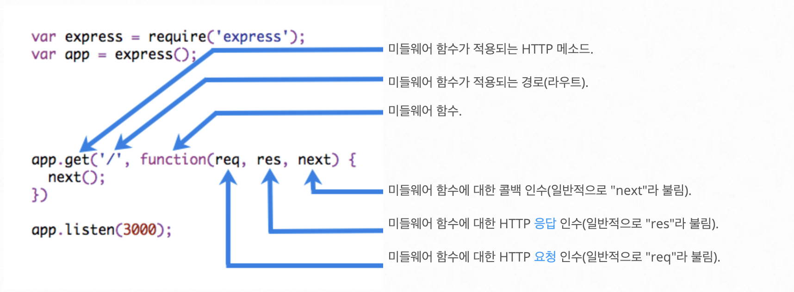

### Node.js
* 마크다운 미리 보기 Ctrl + K V

1. 기본설정
    >express와 필요한 것들 설치
    * npm install -g express-generator
    * express {projectname} && npm install

2. dotenv
    >node를 실행할때 시스템 변수를 명시적으로 지정하는 방법 
     dotenv를 사용하여 관리
    * npm install dotenv
    >프로젝트 루트에 .ev 파일 생성
    * NODE_ENV=development 
      DEBUG={projectname}:server 
      PORT=3000

3. npm start
    >서버를 실행하면 모듈이 없다고 뜨면서 에러가 남 
     npm install 로 모듈 설치 하면 된다

4. Express 미들웨어
    * 미들웨어 함수는 요청 객체(req), 응답객체(res), 다음 미들웨어를 실행하는 next 함수로 이루어져있다
    * 미들웨어란 쉽게 말해서 클라이언트 요청을 처리하여 응답하는 과정 사이에 거쳐가는 함수

5. 라우터 미들웨어
    * Express는 다음과 같은 미들웨어 유형 존재
        * 애플리케이션 레벨 미들웨어
        * 라우터 레벨 미들웨어
        * 오류 처리 미들웨러
        * 써드파티 미들웨어