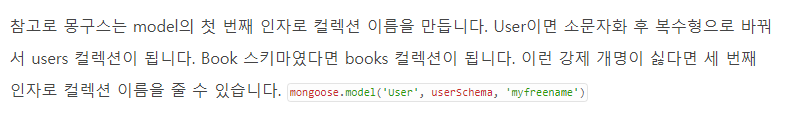

### Node.js
* 마크다운 미리 보기 Ctrl + K V

1. .gitignore 설정
    * gitignore 파일이 있는 곳을 기준으로 상대 경로를 써주면 된다. 단 경로 제일 앞쪽에 ./ 없이 써준다
    * restapi/res/node_modules/*

2. dotenv
    >node를 실행할때 시스템 변수를 명시적으로 지정하는 방법<br>
     dotenv를 사용하여 관리
    * npm install dotenv
    >프로젝트 루트에 .ev 파일 생성
    * NODE_ENV=development<br>
      DEBUG={projectname}:server<br>
      PORT=3000

3. npm start
    >서버를 실행하면 모듈이 없다고 뜨면서 에러가 남<br>
     npm install 로 모듈 설치 하면 된다

4. Express 미들웨어
    * 미들웨어 함수는 요청 객체(req), 응답객체(res), 다음 미들웨어를 실행하는 next 함수로 이루어져있다
    * 미들웨어란 쉽게 말해서 클라이언트 요청을 처리하여 응답하는 과정 사이에 거쳐가는 함수


5. 라우터 미들웨어
    * Express는 다음과 같은 미들웨어 유형 존재
        * 애플리케이션 레벨 미들웨어
        * 라우터 레벨 미들웨어
        * 오류 처리 미들웨러
        * 써드파티 미들웨어

6. 외부함수 불러오기
```js
exports.dbconnection = function() {
    console.log('define')
}
```
>함수 선언부

````js
import db from './DB/DB_connect'

db.dbconnection();

````
>함수 호출

7. DB connect

>DB_connect.js
```js
import mongoose from 'mongoose'

exports.dbconnection = function() {
    //DB connect. env에 connect_uri를 선언
    mongoose.connect(process.env.MONGODB_URI)
    const db = mongoose.connection;

    //error
    db.on('error', function() {
        console.log("DB connection fail");
    })

    //connect
    db.once('open', function() {
        console.log("DB connect!");
    })
}
```

>app.js
```js
import db from './DB/DB_connect'

db.dbconnection();
```

7. MongoDB collection name
    

8. MongoDB create, find, update
    * 준비 과정
        * 디비 스키마를 정의한 파일을 미리 define 해야 한다. 이것은 디비 커넥션 함수와 같이 둔다
        ````js
        require('./DB/schema')

        db.dbconnection();
        ````
        * collection name은 .env에 정의 해둔 URI에 있으며, 접속 주소/{collection_name}이 된다

    * create
        * {dbconnection}.create({schema},{callback function})
        * 예)
        ````js
        const user_create = (req, res, next) => {
            const db_test = require('../DB/schema');
            db_test.create({
                userId : 'minki',
                password: 'test',
                userNmae: '123'
            },
            function(err,user){
                if(err) res.json({message:'err'});
                res.json({message:'creat'});
            })
        }
        ````
    
    * find
        * {dbconnection}.find({find schema},{callback function})
        * 예)
        ````js
        const user_find = (req, res, next) => {
            const db_test = require('../DB/schema');
            db_test.find({}, function(err,users){
                if(err) res.json({message:'err'});
                res.json({message:users});
            })

        }
        ````
    
    * update
        * {dbconnection}.updateOne({find schema}, {set schema}, {collback function})
        * 예)
        ```js
        const user_update = (req, res, next) => {
            db.dbconnection();
            user.updateOne({userId:req.body.userId}, {$set:{userName:req.body.userName}}, function(err,update){
                if(err){
                    res.json({message:'update err', err});
                    return;
                } 
            res.json({message:'update', update});
            })
        }
        ```
    
    * delete
        * {dbconnection}.remove({find schema}, {collback function})
        * 예)
        ```js
        const user_delete = (req, res, next) => {
            db.dbconnection();
            user.remove({
                userId: req.body.userId
            },
            function(err,req){
                if(err) {
                    res.json({message:'delete err'});
                    return;
                }
                res.json({message:'delete'});
            })
        }
        ```

    * mongo DB 도 쿼리문을 유연하게 사용 가능.
    ```js
    var user = User.find({'userid':userid});

      user.remove(function(err){}
    ```
    >이런식으로 먼저 검색 후 그걸 객체로 remove도 가능

9. SESSION 관리
    * session 모듈 install ( npm install express-session )
    ```js
    import session from 'express-session'
    app.get('/', function(req, res, next) {
        let sess = req.session;
        res.json({id:sess.userId, pass: sess.pass})
    }
    ```
    >세션 모듈을 임포트 시킨뒤 req.session 을 변수에 저장, 원하는 세션 명을 정의 하면 된다

10. COOKIE 관리
    * 쿠키 생성
        * cookie 모듈 install ( npm install cookie-parser )
    ```js
    app.get('/',function(req, res, next) {
        let counter;
        counter = req.cookies.counter || 0;
        counter ++
        res.cookie('counter',counter);
        res.json({message:counter});
    }
    ```
    > 쿠키파서 임포트 시킨 뒤 req.cookies.{변수명} 으로 해당 쿠키를 가져온다

    * 쿠키 삭제
    ```js
    app.get('/',function(req, res, next){
        res.clearCookie('counter');
        res.json({message:'del'});
    }
    ```

11. Crawling
    * puppeteer을 이용한 크롤링 - 페이지를 직접 띄우는 방식으로, 동적 웹페이지도 크롤링 가능

    ```js
    const puppeteer = require('puppeteer')
    
    const browser = await puppeteer.launch();
    const page = await browser.newPage(); 

    const url = 'https://developers.google.com/web/'

    await page.goto(url, {waitUntil:'networkidle2'})
    //waitUntil 설정을 해줘야 페이지가 전부 로딩 될때까지 기다린다(동적 페이지 포함)

    await page.evaluate(() => {
        document.querySelector('#searchbox input').value = 'puppeteer' //검색창에 해당 스트링 넣기
    })
    //또는
    await page.type('#searchbox input').value = 'puppeteer'
    ```
    > 대략적인 방법

    * Selector
        * document.querySelector - page.evaluate 안에서 사용할 수 있는 dom
          이 외에도 javascript document로 할수 있는 여러가지를 사용가능
        * jQuery와 검색 방식이 똑같다
            1. class 검색 : $('.className')
            2. id 검색 : $('#idName')
            3. $('.className input') - 이런 경우는 className 클래스 자식 중 input 타입을 가져옴